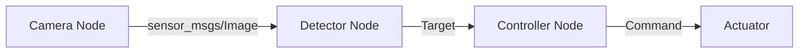

> **Demo content / 示例内容**：用于验证博客排版与功能，可直接删除。

ROS2 把机器人系统拆成一组通过中间件通信的节点。先从一个足够小的工作空间开始，可以避免在包结构和依赖上浪费时间。

## 创建工作空间

```bash
mkdir -p ~/ros2_ws/src
cd ~/ros2_ws
colcon build
source install/setup.bash
```

建议把工作空间的 `install/setup.bash` 写进项目自己的开发脚本，而不是直接加入全局 shell 配置。这样不同 ROS2 发行版不会互相污染。

## 创建 C++ 节点

```cpp
#include <memory>
#include "rclcpp/rclcpp.hpp"

class HeartbeatNode final : public rclcpp::Node {
public:
  HeartbeatNode() : Node("heartbeat") {
    timer_ = create_wall_timer(std::chrono::seconds(1), [this] {
      RCLCPP_INFO(get_logger(), "system alive");
    });
  }

private:
  rclcpp::TimerBase::SharedPtr timer_;
};
```

## 节点通信关系



## 调试检查单

1. 使用 `ros2 node list` 确认节点已经注册。
2. 使用 `ros2 topic hz /camera/image_raw` 检查消息频率。
3. 使用 `ros2 topic info -v <topic>` 检查 QoS 是否兼容。
4. 用 `rqt_graph` 观察系统连接，但不要把它当作唯一诊断依据。

## 下一步

当最小节点稳定运行后，再引入 launch、参数文件和 lifecycle node。保持每一步都能单独构建和验证。
