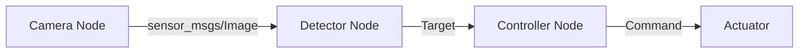

ROS2 把机器人系统拆成一组通过中间件通信的节点。本文记录一条可重复执行的最小 C++ 开发路径：先验证环境，再创建工作空间和节点，最后用命令行确认通信关系。把这些基础步骤跑通后，再引入 launch、参数文件和 lifecycle node。

## 开始前确认环境

先确认当前终端加载的是预期的 ROS2 发行版，避免系统安装、容器环境和多个工作空间互相覆盖：

```bash
printenv ROS_DISTRO
which ros2
ros2 doctor --report
```

如果需要叠加已有工作空间，应按“ROS2 基础环境 → 底层依赖工作空间 → 当前工作空间”的顺序执行 `source`。

## 创建工作空间

```bash
mkdir -p ~/ros2_ws/src
cd ~/ros2_ws
colcon build
source install/setup.bash
```

建议把工作空间的 `install/setup.bash` 写进项目自己的开发脚本，而不是直接加入全局 shell 配置。这样不同 ROS2 发行版不会互相污染。

## 创建 C++ 节点

```cpp
#include <memory>
#include "rclcpp/rclcpp.hpp"

class HeartbeatNode final : public rclcpp::Node {
public:
  HeartbeatNode() : Node("heartbeat") {
    timer_ = create_wall_timer(std::chrono::seconds(1), [this] {
      RCLCPP_INFO(get_logger(), "system alive");
    });
  }

private:
  rclcpp::TimerBase::SharedPtr timer_;
};
```

将节点加入包的 `CMakeLists.txt` 后，优先只构建当前包并开启符号链接安装：

```bash
colcon build --symlink-install --packages-select heartbeat
source install/setup.bash
ros2 run heartbeat heartbeat_node
```

只构建目标包可以缩短反馈周期，也能更快定位依赖声明是否完整。

## 节点通信关系



## 调试检查单

1. 使用 `ros2 node list` 确认节点已经注册。
2. 使用 `ros2 topic hz /camera/image_raw` 检查消息频率。
3. 使用 `ros2 topic info -v <topic>` 检查 QoS 是否兼容。
4. 用 `rqt_graph` 观察系统连接，但不要把它当作唯一诊断依据。

节点能被发现但收不到数据时，按顺序检查 namespace、topic 名称、消息类型和 QoS。跨主机通信还需要确认 `ROS_DOMAIN_ID`、DDS 实现、组播和防火墙配置一致。

## 最小验收

一个可继续扩展的最小工作空间至少应满足：

- 清理 `build/`、`install/`、`log/` 后仍能重新构建；
- 新终端只执行项目约定的环境脚本即可启动；
- `ros2 node list`、`ros2 topic list` 和 `ros2 topic hz` 的结果符合预期；
- 包依赖完整写入 `package.xml` 与 `CMakeLists.txt`，不依赖开发机上的偶然环境。

## 下一步

当最小节点稳定运行后，再逐项引入 launch、参数文件、组合节点和 lifecycle node。每增加一层抽象，都保留对应的启动命令和验收方式。
