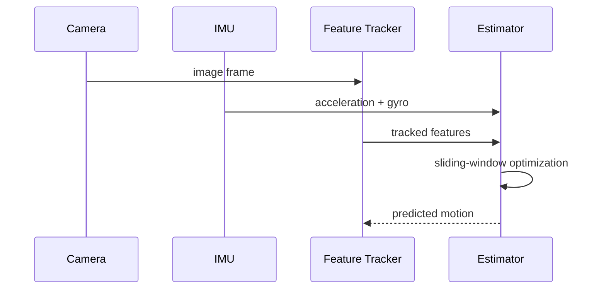

> **Demo content / 示例内容**：用于验证技术文章的公式、图表和目录，可直接删除。

VINS-Fusion 是一个紧耦合视觉惯性里程计系统。理解其数据流，比从入口函数开始逐行阅读更高效。

## 系统数据流

## IMU 预积分

在两个图像帧之间，系统把高频 IMU 测量压缩为预积分量。简化的转动更新可写为：

$$
\Delta R_{ij} = \prod_{k=i}^{j-1} \operatorname{Exp}((\omega_k - b_g)\Delta t)
$$

目标是在不重复积分原始测量的前提下，对 bias 变化进行一阶修正。

## 滑动窗口

后端只维护有限数量的关键帧。新的关键帧进入窗口后，最旧状态通过边缘化被压缩为先验：

$$
\min_x \; \|r_p - H_p x\|^2 + \sum_k \rho(\|r_k(x)\|^2)
$$

工程实现中，应重点检查时间戳、相机—IMU 外参、噪声参数和同步误差；算法结构正确并不代表数据配置正确。

## 阅读代码的路径

建议按照“消息入口 → 测量队列 → 初始化 → 非线性优化 → 边缘化”的顺序阅读，并为每一步记录输入、输出和坐标系。
