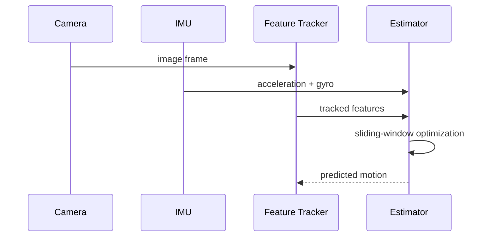

VINS-Fusion 是一个紧耦合视觉惯性里程计系统。阅读或调试这类系统时，先建立“测量如何进入、状态如何更新、结果如何发布”的数据流，再进入具体函数，通常比从入口文件逐行跟踪更高效。

本文关注工程阅读路径和故障边界，不尝试复述完整推导。

## 系统数据流

## IMU 预积分

在两个图像帧之间，系统把高频 IMU 测量压缩为预积分量。简化的转动更新可写为：

$$
\Delta R_{ij} = \prod_{k=i}^{j-1} \operatorname{Exp}((\omega_k - b_g)\Delta t)
$$

目标是在不重复积分原始测量的前提下，对 bias 变化进行一阶修正。

## 滑动窗口

后端只维护有限数量的关键帧。新的关键帧进入窗口后，最旧状态通过边缘化被压缩为先验：

$$
\min_x \; \|r_p - H_p x\|^2 + \sum_k \rho(\|r_k(x)\|^2)
$$

工程实现中，应重点检查时间戳、相机—IMU 外参、噪声参数和同步误差；算法结构正确并不代表数据配置正确。

## 阅读代码的路径

建议按照“消息入口 → 测量队列 → 初始化 → 非线性优化 → 边缘化”的顺序阅读，并为每一步记录输入、输出和坐标系。

### 消息入口与队列

首先记录图像、IMU 和外部定位各自的时间戳来源、频率以及进入队列的条件。重点检查：

- 图像时间戳是否经过相机驱动或硬件同步修正；
- IMU 队列是否覆盖相邻两帧图像之间的完整区间；
- 丢帧、乱序或时间回拨时系统如何处理；
- 回调线程与优化线程之间是否可能长期堆积数据。

### 初始化

初始化阶段负责建立尺度、重力方向、速度和 bias 的可用初值。调试时应把“尚未满足可观测条件”和“计算失败”区分开：运动激励不足、纯旋转、视差不足都可能让初始化持续等待，但不一定是程序错误。

### 优化与边缘化

进入稳定跟踪后，记录滑窗内状态数量、特征数量、每轮求解耗时和边缘化对象。若轨迹突然跳变，应同时检查残差变化、边缘化先验、异常特征比例和时间同步，而不是只调求解器参数。

## 工程检查单

部署到实际平台前，至少固定并版本管理以下信息：

1. 相机内参、畸变模型以及相机—IMU 外参；
2. IMU 噪声密度、随机游走和采样频率；
3. 所有传感器时间戳的时钟源与同步方式；
4. 输入 topic、坐标系方向和单位；
5. 一段可重复回放的数据，以及对应的轨迹和性能基线。

只有配置、数据与代码版本能够一一对应，算法层面的调试结果才可复现。
