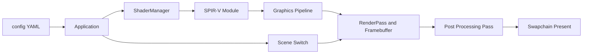

## Overview

Tiny-rasterizer 是一个从零搭建的迷你光栅化渲染器学习项目，最初基于 OpenGL 实现。当前主线工作是把渲染后端整体迁移到 Vulkan，目标是最终只保留一条 Vulkan 渲染路径。

迁移采用分阶段推进：每个阶段都必须能够 configure + build，并保持可运行、可验收，不允许出现长期不可用的中间状态。整体先在 macOS（MoltenVK）上稳定，再收敛 Windows 的驱动与 present mode 差异。

代码以 C++ 为主，配合 GLSL 与 CMake：

```text
C++    86.9%
GLSL    7.3%
CMake   4.7%
Other   1.1%
```

## Architecture



## Software

技术决策上刻意保持依赖最小：

- **窗口系统**：继续使用 GLFW，但只负责窗口生命周期与输入事件，不再持有 OpenGL context。
- **Vulkan 接入**：尽量使用原生 Vulkan C API，暂不引入 Volk / VMA，避免在学习阶段被封装层遮蔽细节。
- **Shader 双模式**：离线编译在构建阶段完成 GLSL → SPIR-V，开发模式支持运行时编译，便于快速迭代。
- **构建与配置**：CMake 配合 `CMakePresets.json`，场景与 shader 参数走 `config/` 下的 YAML；`quick_switch.sh` 用于快速切换配置。

仓库结构上，`include/` 与 `src/` 承载渲染器本体，`shaders/` 存放 GLSL，`config/` 管理场景与参数，`tests/` 与 `.clangd` 支撑开发期验证。

## Roadmap

Vulkan 迁移被拆成 9 个阶段：

- **Phase 0 — 基线冻结与可观测性**：冻结当前 OpenGL 行为作为迁移对照基线，定义启动成功率、平均帧时、resize 稳定性、场景一致性等验收指标，并为渲染日志分层。
- **Phase 1 — 架构解耦**：从主循环抽离渲染后端接口（init / beginFrame / draw / endFrame / resize / shutdown），Shader 拆分为资源加载层与参数描述层，业务层禁止直接调用图形 API。
- **Phase 2 — 构建系统切换 Vulkan**：CMake 依赖改为 `find_package(Vulkan REQUIRED)`，移除 OpenGL / GLEW，macOS 使用 MoltenVK、Windows 使用标准 Vulkan Loader，并增加 shader 编译任务。
- **Phase 3 — Vulkan 核心初始化**：VulkanContext（Instance / Validation Layers / Debug Messenger）、Device 模块（PhysicalDevice / Queue Family / Logical Device）、Surface + Swapchain，以及 fence 与 acquire/present semaphore 帧同步。
- **Phase 4 — 最小可绘制管线**：RenderPass + Framebuffer + GraphicsPipeline，用 Vulkan VertexBuffer 替换 VAO/VBO，引入 UBO + DescriptorSet 替换 glUniform 直写。
- **Phase 5 — 场景与材质兼容**：`config/shader_config.yaml` 支持 GLSL / SPIR-V 双路径，新增 ShaderManager 缓存 `VkShaderModule` 并支持开发期热重载。
- **Phase 6 — 纹理与后处理**：建立纹理上传链路（staging buffer → image → layout transition），新增离屏渲染 + 全屏合成的后处理 pass。
- **Phase 7 — Compute 扩展预留**：预留 ComputeContext（descriptor / pipeline / dispatch），把高开销效果抽象为可迁移 compute 的任务接口。
- **Phase 8 — 跨平台收敛与 OpenGL 移除**：先稳定 macOS 的 swapchain 重建与 validation 清零，再收敛 Windows，最终移除 OpenGL / GLEW 遗留代码与配置。

最近一次提交停在 Phase 6（`phase 6 加载正确`）。仓库给出的推进节奏是：Milestone A 对应 Phase 1–3，Milestone B 对应 Phase 4–5，Milestone C 对应 Phase 6–8。

## Scenes

迁移过程中必须保持 `rotation_matrix`、`fractal`、`water` 三个场景可切换且效果对齐，它们是判断重构是否引入回归的主要依据。

## Verification

各阶段的验收口径：

- 每个阶段均可 configure + build，并保持可运行。
- Phase 3：稳定 present 清屏 5 分钟，无 validation error。
- Phase 4：全屏四边形绘制成功，`time` / `resolution` / `mouse` 参数生效。
- Phase 5：三个场景可切换且稳定。
- Phase 6：纹理加载正确，后处理开关生效，resize 后无错帧。
- Phase 8：移除 OpenGL 后，macOS 与 Windows 的启动 / 渲染 / 退出全流程通过。

## Related Notes

项目推进过程中沉淀的图形学笔记：

- [Vulkan 引擎结构对照](/notes/study-note-shader-bridge-vulkan-engine-map/)
- [多 Pass 与 Framebuffer](/notes/study-note-shader-bridge-multipass-framebuffer/)
- [图形管线心智模型](/notes/study-note-shader-bridge-pipeline-mental-model/)
- [后处理](/notes/study-note-shader-effects-post-processing/)
- [水面渲染](/notes/study-note-shader-rendering-water-rendering/)
- [Shader 速查](/notes/study-note-shader-速查/)

## Repository

源码与分阶段提交记录：<https://github.com/SAM0619TJ/Tiny-rasterizer>
