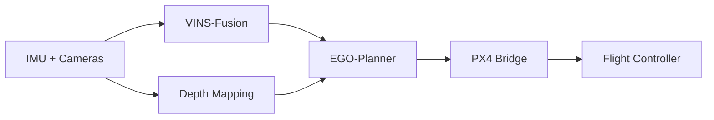

> **Demo project / 示例项目**：用于验证 Projects 页面结构，请替换为真实项目资料。

## Overview

该项目把 VIO、深度感知、轨迹规划和 PX4 飞控接入同一套 ROS2 系统，目标是在有限算力的边缘平台上完成室内自主导航。

## Architecture

## Hardware

- RK3576 edge computer
- Stereo/depth camera
- PX4-compatible flight controller
- Time-synchronized IMU

## Software

核心软件运行在 ROS2 上，各模块使用明确的 QoS 与坐标系约定。容器只用于构建和可复现实验，不进入硬实时控制链路。

## Algorithms

定位由紧耦合 VIO 提供，局部地图由深度相机更新，规划器根据里程计和障碍物生成短时域轨迹。

## Results

示例阶段暂不提供虚构指标。请在替换为真实项目后补充轨迹误差、端到端延迟、CPU/GPU 占用和飞行测试结果。

## Related Blog Posts

- [VINS-Fusion Architecture](/blog/vins-fusion-architecture/)

## Repository

项目入口暂时指向个人 GitHub，请替换为实际仓库地址。
